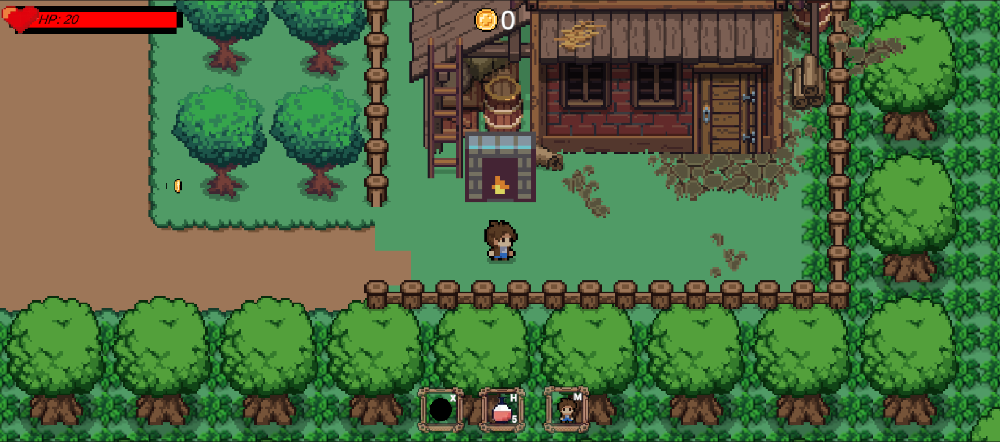

# RPG_MONSTER

เกม RPG 2D มุมมองจากด้านบน (Top-down) สไตล์ Pixel Art พัฒนาด้วย Unity — บังคับตัวละครผจญภัยในหมู่บ้าน ต่อสู้กับมอนสเตอร์ เก็บเหรียญ และเอาตัวรอดด้วย HP ที่มีจำกัด



## ฟีเจอร์

- **ระบบ HP** — แถบเลือดมุมซ้ายบน โดนโจมตีแล้วเลือดลด มีจุดเติมเลือด (แท่นกากบาท) ในหมู่บ้าน
- **ระบบต่อสู้** — โจมตีได้ทั้งซ้ายและขวา มีระยะโจมตีและคูลดาวน์
- **ระบบเหรียญ** — เก็บเหรียญจากฉาก/ศัตรู ตัวนับเหรียญด้านบนของจอ
- **ศัตรู/มอนสเตอร์** — มีเสียงและแอนิเมชันของตัวเอง กำจัดแล้วดรอปของ
- **ฉากหมู่บ้าน Pixel Art** — บ้าน รั้ว ต้นไม้ บรรยากาศแฟนตาซี
- **Hotbar ด้านล่าง** — ช่องไอเทม/สกิล 3 ช่อง (ระเบิด, โพชัน, ตัวละคร)

## วิธีเล่น

1. ดาวน์โหลดไฟล์เกมจากส่วน [Releases](../../releases) (ไฟล์ `RPG_MONSTER.rar`) หรือใช้โฟลเดอร์ `RPG_MONSTER/`
2. แตกไฟล์ แล้วดับเบิลคลิก `RPG_MONSTER.exe` (Windows 64-bit)
3. บังคับตัวละครเดินสำรวจหมู่บ้าน โจมตีมอนสเตอร์ เก็บเหรียญ ระวัง HP หมด (ตาย = จบเกม)

### ปุ่มบังคับ

| ปุ่ม | การทำงาน |
|------|-----------|
| W / A / S / D | เดินขึ้น / ซ้าย / ลง / ขวา |
| Spacebar | โจมตี |
| X | ใช้ไอเทมช่องที่ 1 (ระเบิด) |
| H | ใช้โพชันฟื้นเลือด (ช่องที่ 2) |
| M | ช่องที่ 3 (ตัวละคร) |

## Tech Stack

- **Engine:** Unity (2D, URP/Pixel Perfect)
- **ภาษา:** C# (Assembly-CSharp)
- **แพ็กเกจ:** Input System, Cinemachine, TextMeshPro, 2D Animation/Tilemap
- **Build:** Windows x86_64 (`RPG_MONSTER.exe`)

## โครงสร้างไฟล์

```
rpg-monster/
├── README.md
├── RPG_MONSTER.exe        # ตัวเกม (Windows 64-bit) + โฟลเดอร์ RPG_MONSTER/
│   └── RPG_MONSTER_Data/  # ข้อมูลเกม (ฉาก, สคริปต์, แอสเซ็ต)
├── RPG_MONSTER.rar        # ไฟล์เกมแบบบีบอัด
└── game.png               # ภาพตัวอย่างเกม
```
